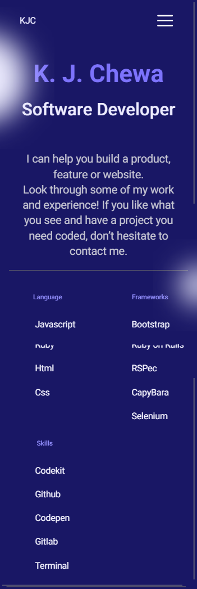

# My portfolio

> This project was the second in my Microverse journey that needed a code review. I had to set the foundations of what would be my personal portfolio. The goal was to be able to parse a Figma design to create a beautiful UI using flexbox, images and backgrounds, while sticking to the best practices (Linter, Github Flow, Professional commits and documentation etc.)

> This is just the first part out of ten before getting to the full portfolio website. In this part the focus was put on the mobile version skeleton. I was supposed to build a UI that is as close as possible to this Figma design: [Figma Template](https://www.figma.com/file/l7SqJ3ZfkAKih9sFxvWSR4/Microverse-Student-Project-1?node-id=23%3A10)

## Built With

- HTML, CSS (with a focus on Flexbox and images manipulation)
- Github Flow, Linter

## Live Demo

There is no live demo available for this project. I provided a screenshot instead.

## Author

👤 **King Josaphat Chewa (KJC)**

- GitHub: [@Kingjosh007](https://github.com/Kingjosh007)
- Twitter: [@KingJoChewa](https://twitter.com/KingJoChewa)
- LinkedIn: [LinkedIn](https://www.linkedin.com/in/king-josaphat-chewa-aa154011b/)

## 🤝 Contributing

Contributions, issues, and feature requests are welcome!

Feel free to check the [issues page](../../issues/).

## Show your support

Give a ⭐️ if you like this project!

## Acknowledgments

- Microverse

## 📝 License

This project is [MIT](./MIT.md) licensed.
