# My portfolio

> This project was part of my Microverse journey. I had to work on what would be my personal portfolio. The goal was to be able to parse a Figma design to create a beautiful UI using Flexbox, Grid CSS, images and backgrounds, while sticking to the best practices (Linter, Github Flow, Professional commits and documentation etc.)

> I was supposed to build a UI that is as close as possible to this Figma design: [Figma Template](https://www.figma.com/file/l7SqJ3ZfkAKih9sFxvWSR4/Microverse-Student-Project-1?node-id=23%3A10) 

This project was divided into 10 parts before getting to the full portfolio website. Each part corresponds to a specific branch. The 10 parts are listed below. The text in **bold** refers to the part I am currently working on. Refer to the corresponding branch.

1. Setup and mobile version skeleton
2. List of previous projects + About myself (mobile)
3. Add a contact form + finish the mobile version
4. **Create the desktop version using media queries**
5. Deploy on Github Pages
6. Changes regarding accessibility
7. Mobile menu using JavaScript
8. Popup window that includes the project details 
9. Client-side validation in the contact form
10. Use local storage to save form data

## Screenshots

💻 **Desktop version**

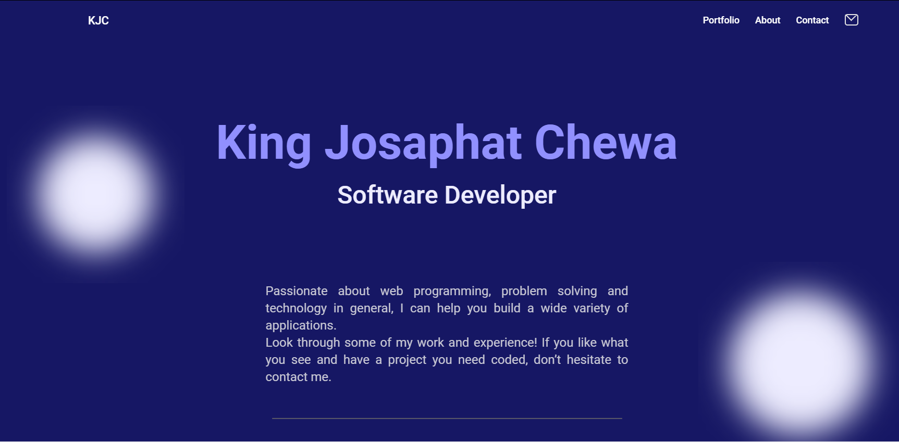 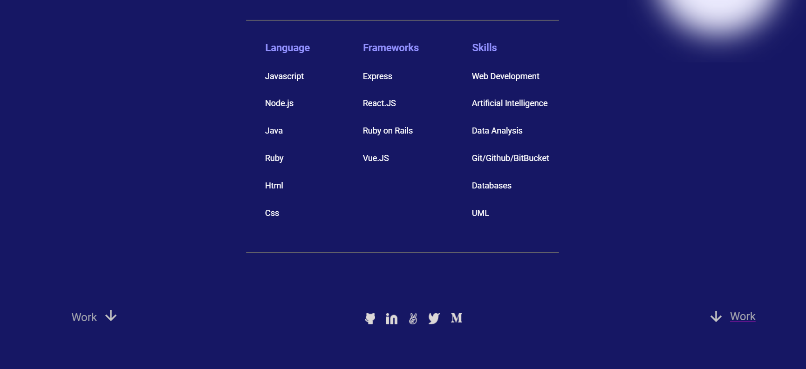 
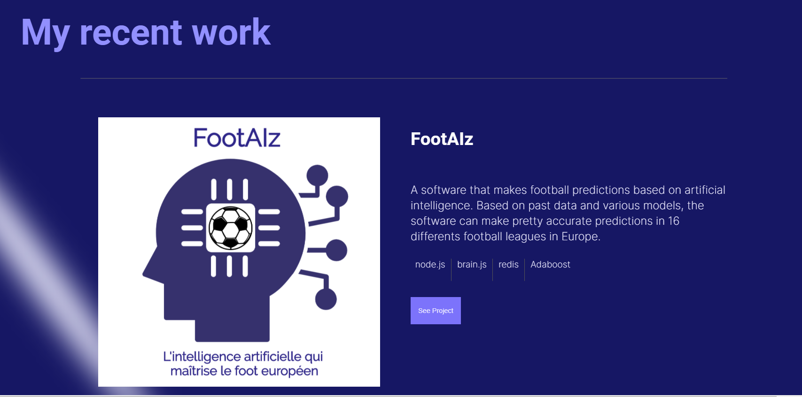 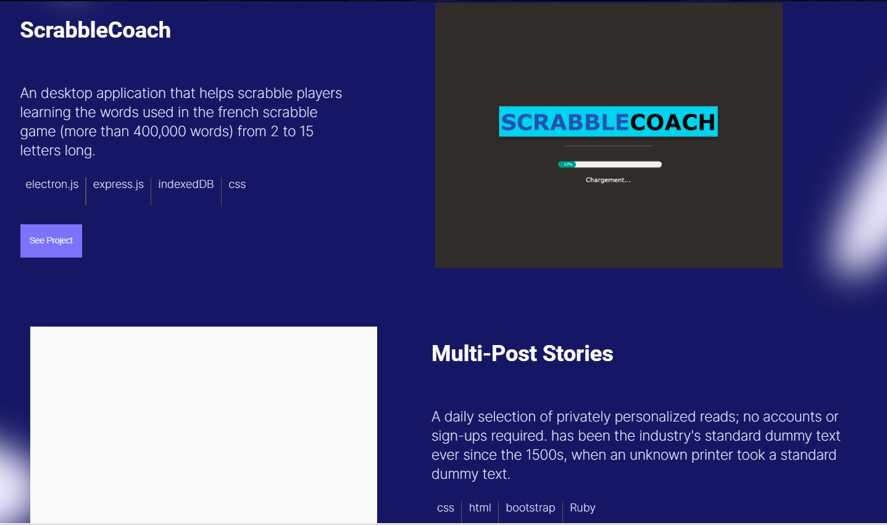 
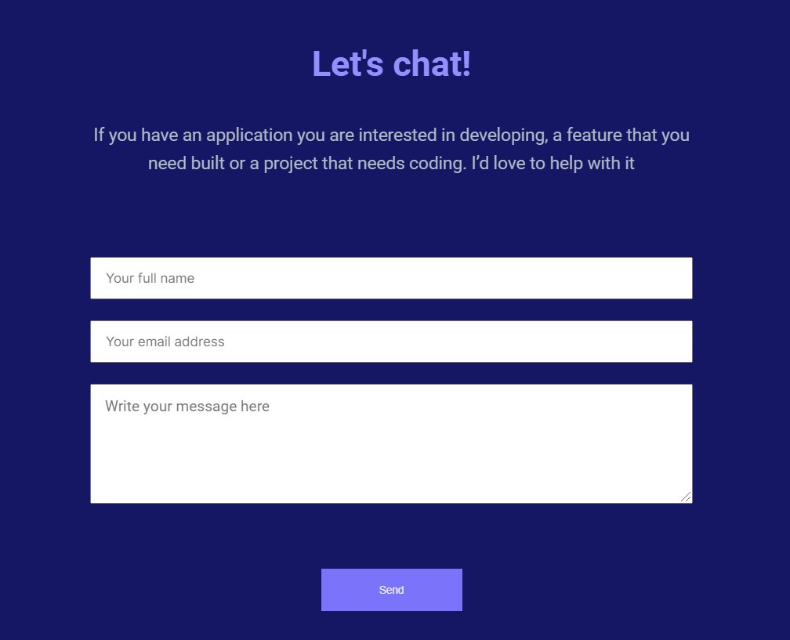 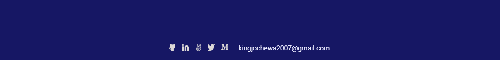 

📱 **Mobile version** 

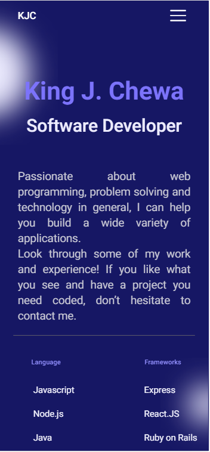 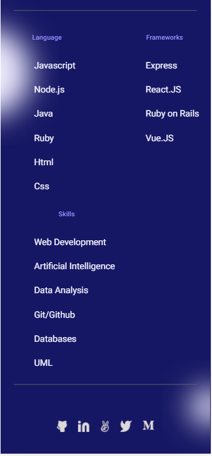 
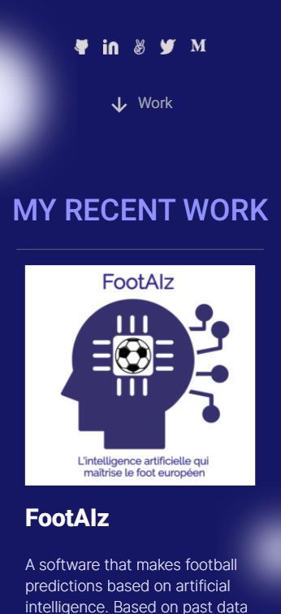  
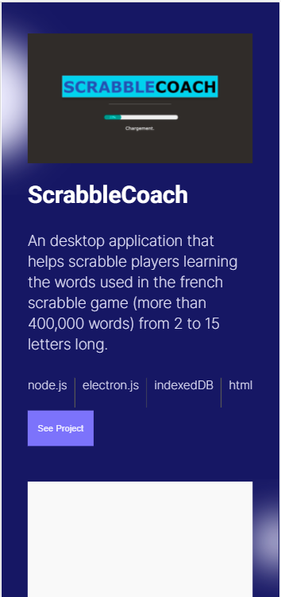 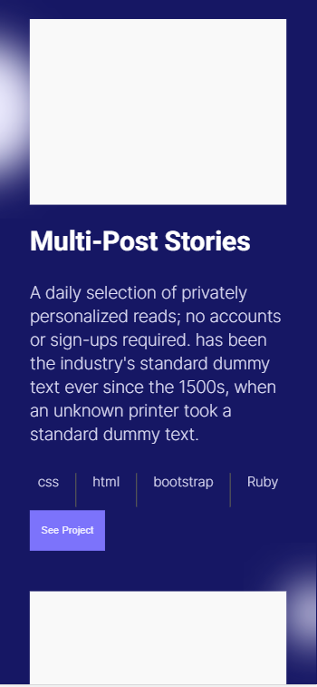 
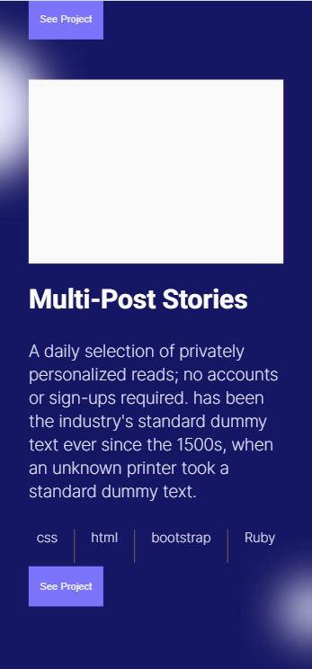 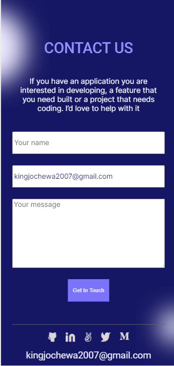 

## Built With

- HTML, CSS (with a focus on Flexbox, Grid and images and background manipulation)
- Github Flow, Linter

## Live Demo

There is no live demo available yet for this project. I provided several screenshots instead.

## Author

👤 **King Josaphat Chewa (KJC)**

- GitHub: [@Kingjosh007](https://github.com/Kingjosh007)
- Twitter: [@KingJoChewa](https://twitter.com/KingJoChewa)
- LinkedIn: [LinkedIn](https://www.linkedin.com/in/king-josaphat-chewa-aa154011b/)

## 🤝 Contributing

Contributions, issues, and feature requests are welcome!

Feel free to check the [issues page](../../issues/).

## Show your support

Give a ⭐️ if you like this project!

## Acknowledgments

- Microverse
- [@Kingstalux](https://github.com/Kingstalux), which whom I created the contact form through pair-programming
- A huge thanks to [@Tchilo](https://github.com/Tchilo) and [@benshidanny11](https://github.com/benshidanny11), from my morning session team, for reviewing the code of the desktop version

## 📝 License

This project is [MIT](./MIT.md) licensed.
